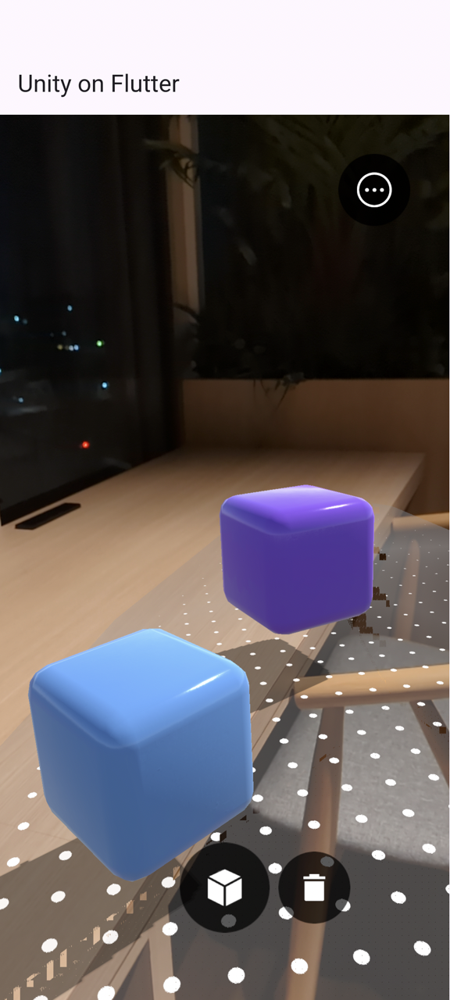

# flutter_unity_widget_ex

| AR Foundationの実行 |
|--------|
|  |

## セットアップ時に遭遇したエラーと対策

ドキュメント通り実行しても遭遇するエラーがいくつかあるので注意が必要。

### could not be found in project ':unityLibrary'

- おそらく大抵は遭遇する
  - ref. https://github.com/juicycleff/flutter-unity-view-widget/issues/844#issuecomment-1640963178
- `settings.gradle`に以下を追記で解消

```gradle
include ':unityLibrary:xrmanifest.androidlib'
```

### [CXX1100] Both android.ndkPath and ndk.dir in local.properties are set

- シンプルに`local.properties`の記載を削除すれば良い（ドキュメント通り実行すると必ず遭遇する）
  - ref. https://github.com/juicycleff/flutter-unity-view-widget/issues/832#issuecomment-1627557580

---

以降は、AR Foundationを利用する際に必要なセットアップと発生するエラー

---

### MainActivity.kt: (3, 37): Unresolved reference: FlutterUnityActivity

- `FlutterUnityActivity`の実装が入っているのは`master`だけらしい
  - ref. https://github.com/juicycleff/flutter-unity-view-widget/issues/836#issuecomment-1966512577
- 以下の修正のPRが入ったのはpub.devに上がった後なのでまだリリースされてない
  - ref. https://github.com/juicycleff/flutter-unity-view-widget/pull/908


### レポジトリが大きすぎてpub getできない問題

`FlutterUnityActivity.kt`を取り込むために`master`の任意のコミットを指定してpub getしようとすると、ファイルサイズ大きすぎて持ってこれない問題。

```bash
❯ flutter pub get
Resolving dependencies... (1:02.6s)
Git error. Command: `git clone --mirror https://github.com/juicycleff/flutter-unity-view-widget /Users/tsuruoka/.pub-cache/_temp/dirQ8Vojt`
stdout:
stderr: Cloning into bare repository '/Users/tsuruoka/.pub-cache/_temp/dirQ8Vojt'...
error: RPC failed; curl 92 HTTP/2 stream 5 was not closed cleanly: CANCEL (err 8)
error: 238 bytes of body are still expected
fetch-pack: unexpected disconnect while reading sideband packet
fatal: early EOF
fatal: fetch-pack: invalid index-pack output
exit code: 128
```

### pub getできないので`IFlutterUnityActivity`を作成する代替案で対応

- CustomActivity用に[Platform Setup](https://github.com/juicycleff/flutter-unity-view-widget?tab=readme-ov-file#platform-specific-setup-after-unity-export)の3.2が記載されているが、要は`FlutterUnityActivity`相当の実装を用意すれば良いだけなので、バージョン`^2022.2.1`でも以下の`MainActivgity.kt`にすれば動く。

```kt
// MainActivity.kt
package com.htsuruo.flutter_unity_widget_ex

import io.flutter.embedding.android.FlutterActivity
import com.xraph.plugin.flutter_unity_widget.IFlutterUnityActivity;

class MainActivity: FlutterActivity(), IFlutterUnityActivity {
    // unity needs this mUnityPlayer property
    @JvmField
    var mUnityPlayer: java.lang.Object? = null;

    // implement this function so the FUW plugin can set mUnityPlayer
    override fun setUnityPlayer(unityPlayer: java.lang.Object?) {
        mUnityPlayer = unityPlayer;
    }
}
```
